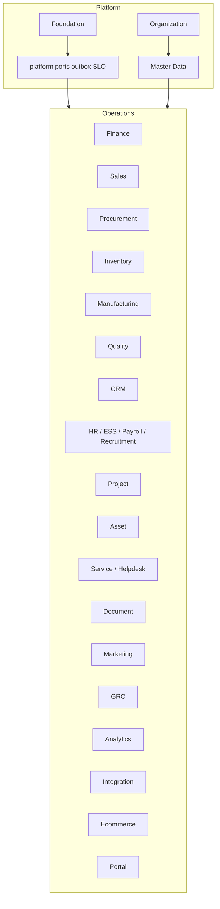

# iConnect Plus — Master Architecture (current)

**Document type:** Solution architecture (living)  
**Baseline:** Architecture Lock v1.1 · Addendum v1.2  
**Updated:** 2026-10-08  
**Audience:** Engineering, Architecture, DevOps, Product  

For day-to-day module detail prefer [`docs/00_CURRENT/`](../00_CURRENT/). This document is the consolidated architecture view.

---

## 1. Executive summary

iConnect Plus is a **modular monolith** ERP: one API (`/api/v1`), one PostgreSQL OLTP, one Next.js admin UI, shared Workflow / Notification / Audit engines, and a **`modules.platform`** seam layer (ports, outbox, numbering, approval matrix, encryption, SLOs).

| Decision | Choice |
|----------|--------|
| Architecture | Modular monolith · Clean Architecture · DDD (ADR-001) |
| Backend | Python 3.13 · FastAPI · SQLAlchemy 2 · Alembic · Pydantic v2 · Celery (ADR-002) |
| Frontend | Next.js 16+ · TypeScript · Tailwind · ShadCN |
| OLTP | PostgreSQL |
| Cache / broker | Redis · RabbitMQ |
| Objects | MinIO / AWS S3 |
| Auth | Entra SSO · JWT HttpOnly cookies |
| Deploy | Docker Compose · Coolify on EC2 |

## 2. Module map



Full catalog: [`00_CURRENT/MODULE_CATALOG.md`](../00_CURRENT/MODULE_CATALOG.md).

## 3. Request and async flows

### Sync HTTP

```text
UI → /api/v1/{module}
   → require_permission + TenantContext
   → Router → Service → Repository → PostgreSQL
   → Platform facades (audit/notify) / workflow_gate / SSOT numbering
```

### Async

```text
Service enqueues FndOutboxMessage
Celery platform.outbox_drain
   → notify | audit | finance | integration | domain projections
```

System jobs claim `(job_name, window_key)` in `fnd_job_run` so beat redelivery cannot double-apply side effects.

## 4. Cross-cutting engines

| Engine | Implementation |
|--------|----------------|
| Workflow | Foundation `WorkflowService` · started via governance + `workflow_gate` |
| Notification | Foundation templates/events · `PlatformNotifyFacade` / outbox |
| Audit | Foundation audit · `PlatformAuditFacade` / outbox |
| Numbering | `FndDocumentSequence` via platform numbering adapter |
| Finance posting | `FinancePostingAdapter` only |
| Stock | `InventoryStockAdapter` only |
| Integration | Hub + SSRF-guarded webhook connector |
| Encryption | Column `TypeDecorator`s + `FIELD_ENCRYPTION_KEYS` |

## 5. Data rules (DBS)

- UUID PKs, audit columns, soft delete  
- `tenant_id` (+ company/branch on transactional tables)  
- Alembic-only migrations  
- No cross-module ORM outside adapters; master reads via `published` projections  

## 6. Security

- RBAC permission catalogs per module; CI ensures routes/UI codes exist  
- HttpOnly session cookies; privileged token TTL shorter  
- Upload scanning via ClamAV  
- Field-level encryption for tax / KYC / bank / integration secrets  
- Security evidence: `docs/security/` · accepted Wiz risks in that folder  

## 7. Deployment

| Environment | Compose / guide |
|-------------|-----------------|
| Local all-in-one | `docker-compose.local.yml` |
| Infra VM | `docker-compose.infra.yml` |
| App against external infra | `docker-compose.app.yml` |
| Coolify / EC2 | `docker-compose.coolify.yml` · [`09_OPS/coolify-deploy.md`](../09_OPS/coolify-deploy.md) |

Backup restore drill: `apps/api/scripts/restore_drill.py`.

## 8. Evolution gates

Tier D (extract / K8s-only / OpenSearch-required / warehouse) stays behind
`modules/platform/evolution.py`. Do not start microservice splits while the
modular monolith ports + outbox + debt gates are the active design.

## 9. Document hierarchy

```text
BRD → FRD → SDD v1.1 → DBS v1.1 → Architecture Lock v1.1
                              ↘ Addendum v1.2 + 00_CURRENT (implementation)
```

Code must not violate the lock. When implementation advances the lock’s
*remaining work* list, update Addendum v1.2 / `00_CURRENT` — do not silently
edit the historical lock report.
